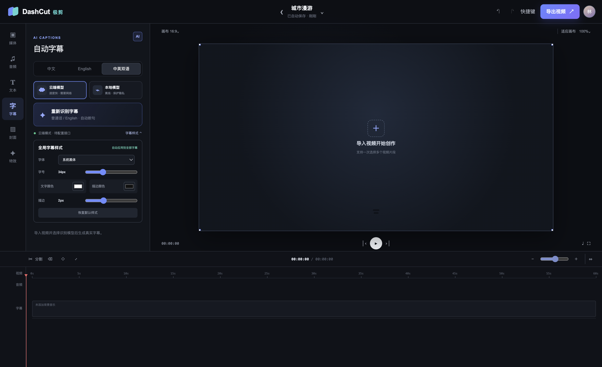
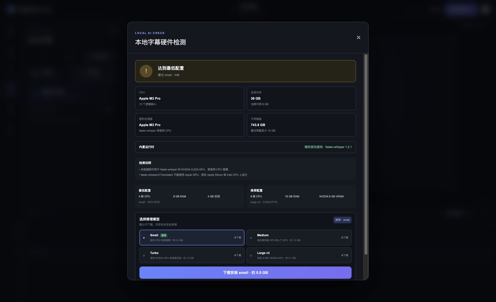

# DashCut 极剪

[简体中文](README.zh-CN.md) · [Download](https://github.com/Mikasathebest/DashCut/releases/latest) · [Report an issue](https://github.com/Mikasathebest/DashCut/issues)

## 1. Overview

DashCut (极剪) is a desktop-first video editor for Bilibili and YouTube creators. It focuses on the repetitive work around creator videos: import multiple clips, split and rearrange a timeline, add background music, generate a 1280 × 720 cover image, create time-aligned Chinese or English captions with local `faster-whisper`, apply one font/color/size style to every caption, and prepare 30 or 60 FPS exports. The local AI workflow checks CPU, GPU, memory, and disk before recommending a model; model weights are never downloaded until the user explicitly clicks install, and packaged users do not need to configure Python or other AI dependencies.

Highlights:

- Multi-clip import, preview, timeline splitting, and removal
- Local Chinese and English speech recognition with editable caption timing and text
- Global caption font, size, color, outline, and background controls
- On-demand `small`, `medium`, `turbo`, and `large-v3` model management
- Automatic hardware assessment with CPU INT8 and NVIDIA CUDA recommendations
- Background music controls, 16:9 / 9:16 canvases, and a cover-image studio
- Bilibili and YouTube export presets with 30 / 60 FPS choices
- Unsigned Windows x64 one-click `.exe` releases and macOS arm64 / Intel x64 `.dmg` releases; Apple credentials automatically enable signing and notarization

> Current status: local source-language transcription is implemented. The cloud provider and automatic Chinese ↔ English translation are not configured yet; the second-language caption can be edited manually in the current release.

## 2. Installation

### Download an installer

[**Download the latest DashCut release →**](https://github.com/Mikasathebest/DashCut/releases/latest)

- Windows: download the x64 `.exe` and double-click it. Because it is unsigned, Windows may show an unknown-publisher or SmartScreen confirmation.
- macOS: download the `.dmg` matching your Mac (arm64 for Apple Silicon, x64 for Intel), open it, and move DashCut to Applications. Until the release is notarized, first launch may require right-clicking DashCut and choosing **Open**, or allowing it in **System Settings → Privacy & Security**.
- Local caption models are not bundled. Open **Captions → Local model**, review the hardware recommendation, then click **Download and install** for the model you want.

### Build and run manually

Requirements: Node.js 22.13+ and Python 3.9+ (Python is only needed to build the self-contained local AI runtime).

```bash
git clone https://github.com/Mikasathebest/DashCut.git
cd DashCut
npm install
npm run runtime:build
npm run desktop
```

Create local installers with:

```bash
npm run dist:win   # Windows x64 .exe
npm run dist:mac   # macOS .dmg
```

Windows x64 releases produce an unsigned one-click `.exe` without credentials; Windows may display an unknown-publisher or SmartScreen warning. macOS arm64 and Intel x64 DMGs are also produced without credentials, but Apple Developer credentials are required to sign and notarize them for a normal Gatekeeper launch. See [`docs/CODE_SIGNING.md`](docs/CODE_SIGNING.md). Installers include a self-contained LGPL FFmpeg runtime built natively with VideoToolbox on macOS or MediaFoundation on Windows; details and compliance artifacts are documented in [`docs/FFMPEG_RUNTIME.md`](docs/FFMPEG_RUNTIME.md).

## 3. Tutorial



### Import and edit multiple clips

1. Open **Media** and select multiple video files in one import.
2. Select a clip on the timeline, move the playhead, and click **Split**.
3. Open **Audio** to add a music file and set its volume.
4. Open **Cover** to edit the title/accent color and save a 1280 × 720 PNG thumbnail.

### Extract Chinese or English captions locally

1. Open **Captions**, choose **Local model**, and let DashCut inspect the device.
2. Review the detected CPU, NVIDIA GPU, memory, disk, and runtime status. Pick the recommended model or another supported model.
3. Click **Download and install**. Nothing is downloaded before this explicit action.
4. Import the clips, select the subtitle view (**中文**, **English**, or **双语**), then click **Generate captions**.
5. `faster-whisper` detects each clip's spoken language. Chinese recognition is written to the Chinese field; English recognition is written to the English field. Review each line and correct names or punctuation before export.
6. For a bilingual layout today, enter the translated second line manually. Automatic Chinese ↔ English translation will be enabled after a cloud/local translation provider is integrated.



### Apply one subtitle style everywhere

1. In **Captions**, click **Subtitle style**.
2. Choose the font, text size, text color, outline color/width, and background opacity.
3. Changes are applied immediately to every caption and reflected in the preview. Use **Restore defaults** to reset the full style.
4. Choose the Bilibili or YouTube preset, select 30 or 60 FPS, and export after reviewing the timeline.

## 4. Contributing and merging code

1. Fork the repository and create a focused branch such as `feat/subtitle-translation` or `fix/timeline-split`.
2. Install dependencies with `npm install`, implement the change, and add or update tests.
3. Run `npm run lint`, `npm test`, and `npm run desktop:smoke` before pushing.
4. Use a clear conventional commit, for example `feat: add bilingual translation provider`.
5. Push the branch and open a pull request against `main`. Explain the user impact, verification steps, platforms tested, and include screenshots for UI changes.
6. A maintainer reviews the pull request. Merge only after required checks pass and review comments are resolved; prefer **Squash and merge** so `main` keeps one coherent commit per pull request.

Please keep credentials, model weights, build output, and signing certificates out of commits. For larger changes, open an issue first so the implementation and compatibility plan can be agreed on.

## 5. License

DashCut is released under the [MIT License](LICENSE). FFmpeg is distributed under LGPLv2.1-or-later; other components and downloaded AI models remain subject to their own licenses and terms. See [Third-party notices](THIRD_PARTY_NOTICES.md).
